# Create your first mapper

Create a mapper declaration as a partial class
and apply the `Riok.Mapperly.Abstractions.MapperAttribute` attribute.
Mapperly generates mapping method implementations for the defined mapping methods in the mapper.

```csharp title="Mapper declaration"
[Mapper]
public partial class CarMapper
{
    public partial CarDto CarToCarDto(Car car);
}
```

```csharp title="Mapper usage"
var mapper = new CarMapper();
var car = new Car { NumberOfSeats = 10, ... };
var dto = mapper.CarToCarDto(car);
dto.NumberOfSeats.ShouldBe(10);
```
## Mermaid Examples

### Example 1

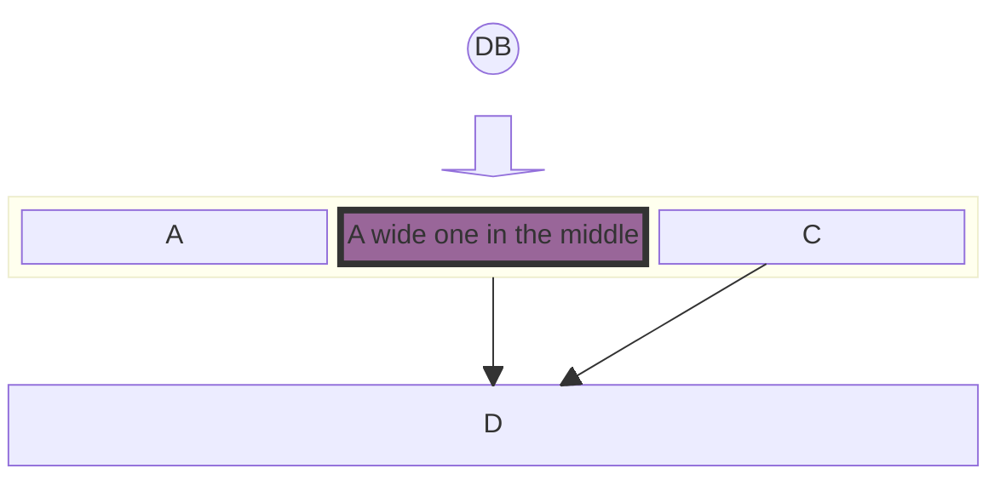

### Example 2

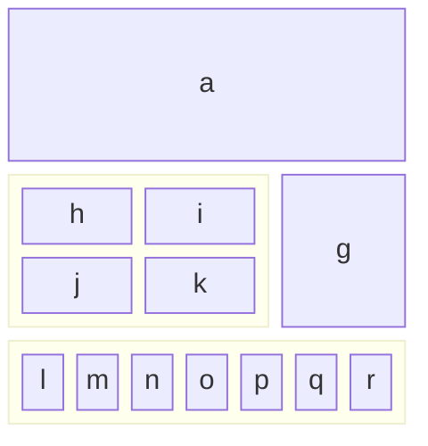

### Example 3

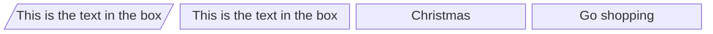

### Example 4

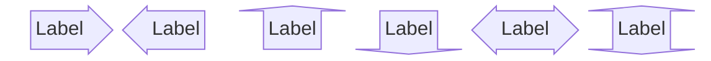

### Example 5

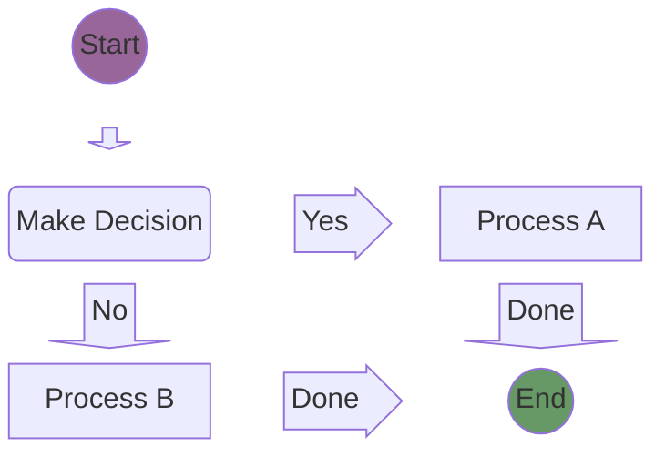

### Example 6

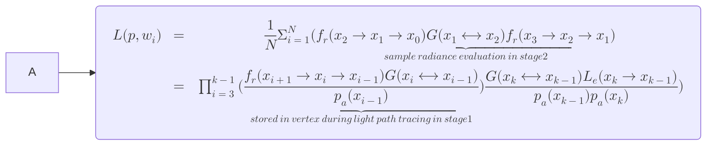

### Example 7

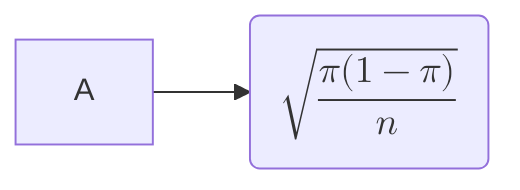
## Invalid Diagrams

Those errors should not crash the whole page

### Invalid type

```bash
badType
    participant Alice
    participant Bob
```

### Invalid content

```bash
sequenceDiagram
    badInstruction Alice
    participant Bob
```

## Sequence Diagram

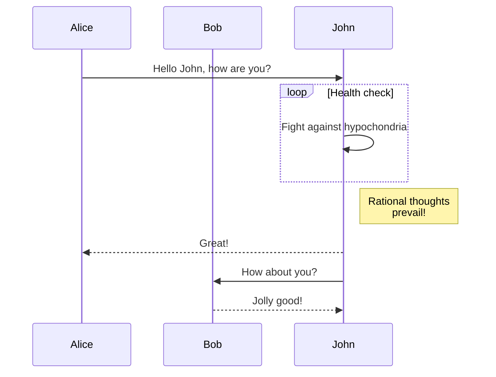

## Sequence Diagram (forest theme directive)

It is possible to override default config locally with Mermaid text directives such as:

```bash
%%{init: { "theme": "forest" } }%%
```

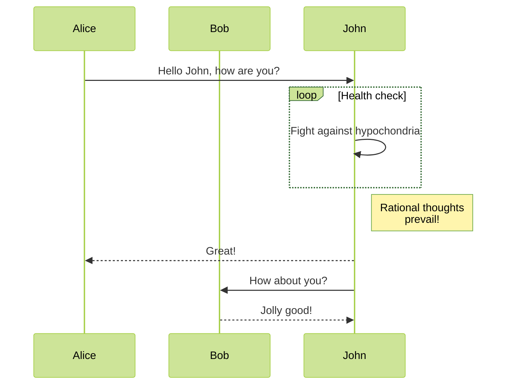

## Gantt Chart

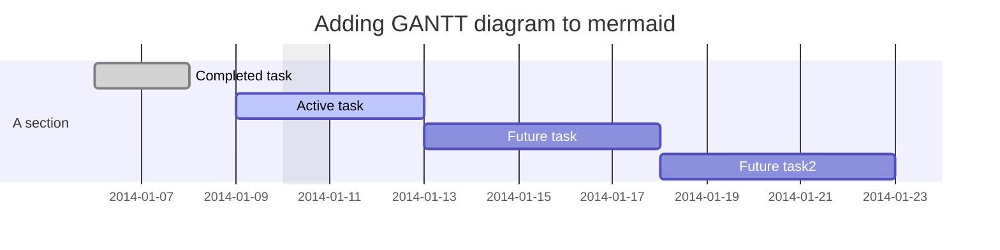

## Flow Chart

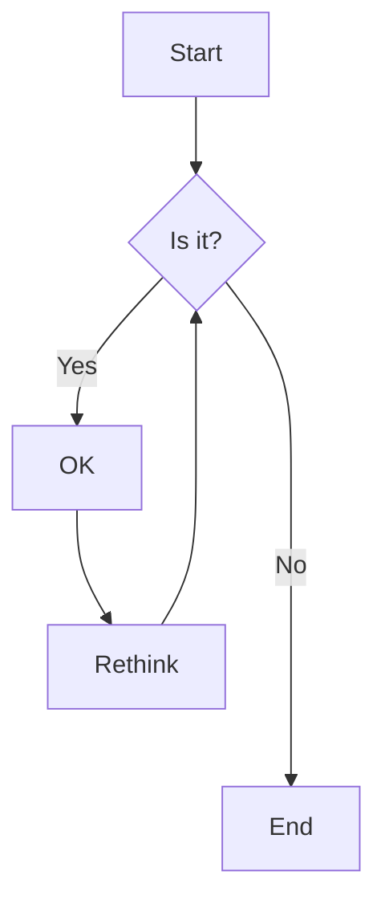

### With Markdown:

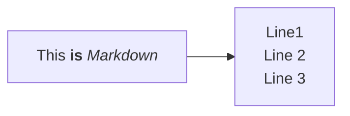

## Class Diagram

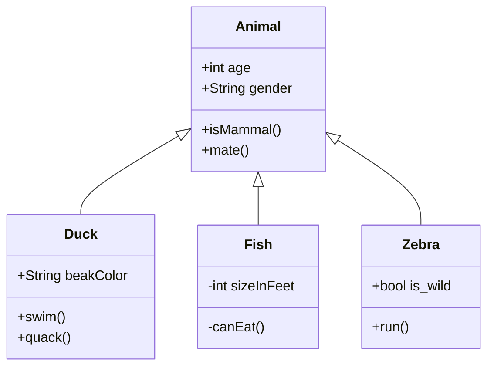

## State Diagram

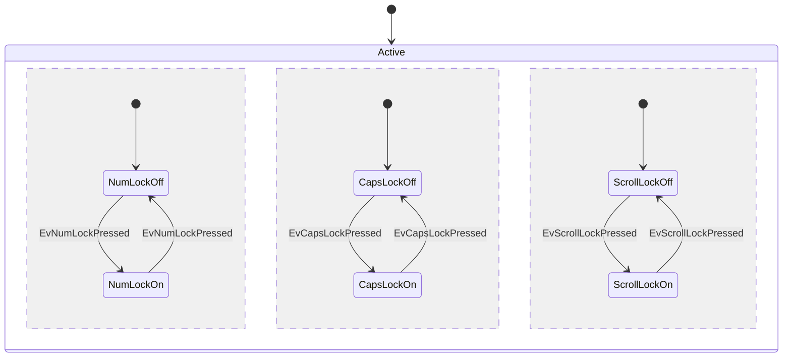

## Entity Relationship Diagram

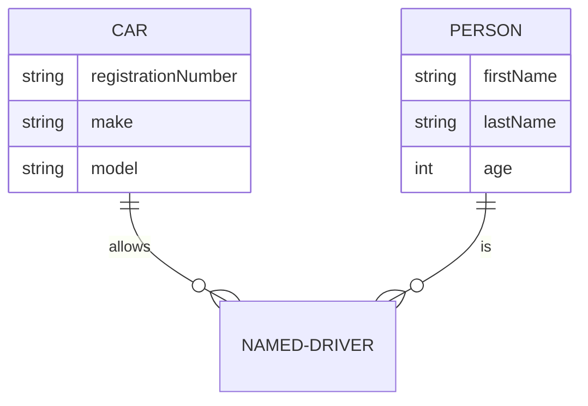

## User Journey

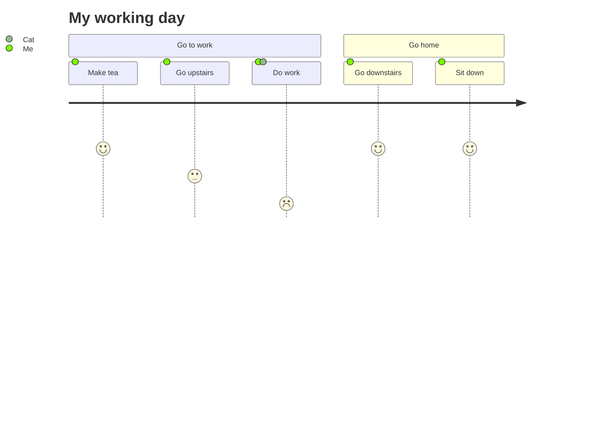

:::note

If there's too much space above it's due to a [Mermaid bug](https://github.com/mermaid-js/mermaid/issues/3501)

:::

## Pie Chart

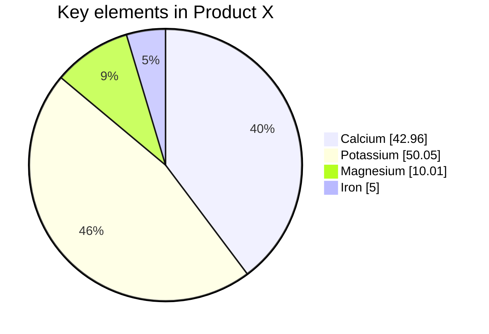

## Requirement Diagram

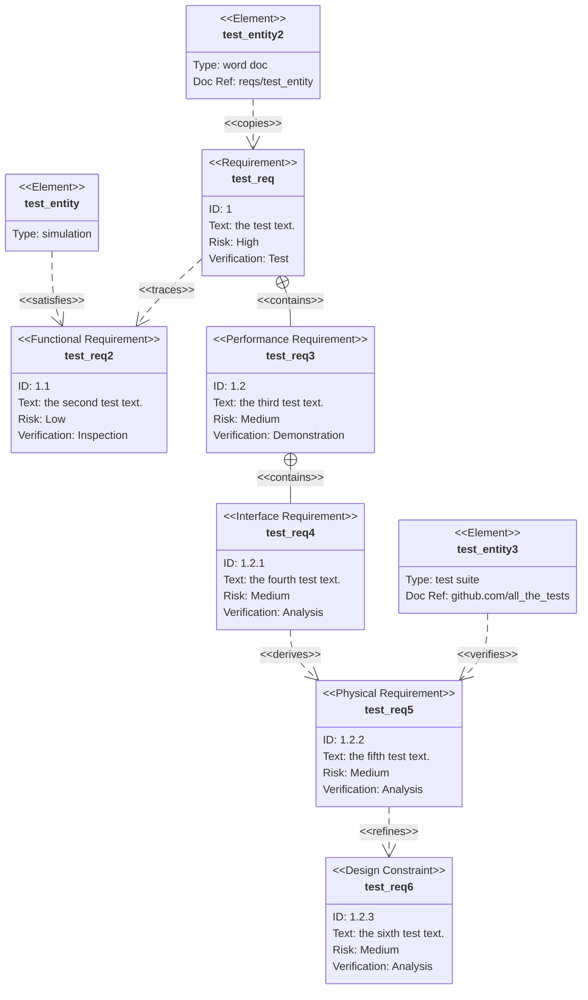

## Gitgraph (Git) Diagram

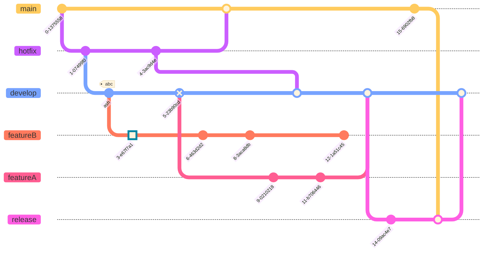

## Mermaid in tabs

The following mermaid diagram is shown:

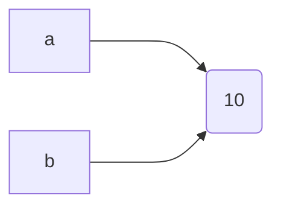

## Mindmap

```mermaid
mindmap
  root((conda-forge))
    (Repos)
        (Package building)
            [*-feedstock]
            [staged-recipes]
            [cdt-builds]
            [msys2-recipes]
        (Maintenance)
            [admin-requests]
            [repodata-patches]
        (Configuration)
            [.github]
            [.cirun]
            [conda-forge-pinning]
            [conda-forge-ci-setup]
            [docker-images]
            [conda-smithy]
        (Automations)
            [admin-migrations]
            [artifact-validation]
            [regro/cf-scripts]
            [conda-forge-webservices]
            [regro/cf-graph-countyfair]
            [regro/libcfgraph + regro/libcflib]
            [feedstock-outputs]
        (Communications)
            [conda-forge.github.io]
            [blog]
            [status]
            [by-the-numbers]
            [conda-forge-status-monitor]
            [feedstocks]
    (Bots & apps)
        [conda-forge-admin]
        [conda-forge-bot]
        [conda-forge-coordinator]
        [conda-forge-daemon]
        [conda-forge-linter]
        [conda-forge-manager]
        [conda-forge-status]
        [regro-cf-autotick-bot]
        [conda-forge-curator]
        [conda-forge-webservices]
    (Delivery)
        [anaconda.org]
        [ghcr.io]
        [quay.io]
    (Installers)
        Miniforge
        Mambaforge
    (CI for builds)
        Azure Pipelines
        Travis CI
        cirun.io
    (Infra)
        Heroku
        Github Actions
        Circle CI
```

## Quadrant Chart

```mermaid
quadrantChart
    title Reach and engagement of campaigns
    x-axis Low Reach --> High Reach
    y-axis Low Engagement --> High Engagement
    quadrant-1 We should expand
    quadrant-2 Need to promote
    quadrant-3 Re-evaluate
    quadrant-4 May be improved
    Campaign A: [0.3, 0.6]
    Campaign B: [0.45, 0.23]
    Campaign C: [0.57, 0.69]
    Campaign D: [0.78, 0.34]
    Campaign E: [0.40, 0.34]
    Campaign F: [0.35, 0.78]
```

## Architecture Diagram

- See https://mermaid.js.org/syntax/architecture
- See https://github.com/facebook/docusaurus/discussions/10508

```mermaid
architecture-beta
    group api(cloud)[API]

    service db(database)[Database] in api
    service disk1(disk)[Storage] in api
    service disk2(disk)[Storage] in api
    service server(server)[Server] in api

    db:L -- R:server
    disk1:T -- B:server
    disk2:T -- B:db
```

## ELK Styling

Mermaid provides an [ELK layout](https://mermaid.js.org/syntax/entityRelationshipDiagram.html#layout)

### Dagre

This is a "classical" Mermaid diagram, using the default Dagre layout.

```mermaid
erDiagram

  COMPANY ||--o{ DEPARTMENT : has
  COMPANY ||--o{ PROJECT : undertakes
  COMPANY ||--o{ LOCATION : operates_in
  COMPANY ||--o{ CLIENT : serves

  DEPARTMENT ||--o{ EMPLOYEE : employs
  DEPARTMENT ||--o{ PROJECT : manages
  DEPARTMENT ||--o{ BUDGET : allocated

  EMPLOYEE }o--o{ PROJECT : works_on
  EMPLOYEE ||--|| ADDRESS : lives_at
  EMPLOYEE }o--o{ SKILL : has
  EMPLOYEE ||--o{ DEPENDENT : supports

  PROJECT ||--o{ CLIENT : for
  PROJECT ||--o{ TASK : contains

```

### ELK er diagram layout

This ER diagram should look different, using the ELK layout.

```mermaid
---
config:
  layout: elk
---
erDiagram

  COMPANY ||--o{ DEPARTMENT : has
  COMPANY ||--o{ PROJECT : undertakes
  COMPANY ||--o{ LOCATION : operates_in
  COMPANY ||--o{ CLIENT : serves

  DEPARTMENT ||--o{ EMPLOYEE : employs
  DEPARTMENT ||--o{ PROJECT : manages
  DEPARTMENT ||--o{ BUDGET : allocated

  EMPLOYEE }o--o{ PROJECT : works_on
  EMPLOYEE ||--|| ADDRESS : lives_at
  EMPLOYEE }o--o{ SKILL : has
  EMPLOYEE ||--o{ DEPENDENT : supports

  PROJECT ||--o{ CLIENT : for
  PROJECT ||--o{ TASK : contains

```

Mermaid also provides a way of setting config parameters using a directive `%%{init:{"layout":"elk"}}%%`

```mermaid
%%{init:{"layout":"elk"}}%%
erDiagram

  COMPANY ||--o{ DEPARTMENT : has
  COMPANY ||--o{ PROJECT : undertakes
  COMPANY ||--o{ LOCATION : operates_in
  COMPANY ||--o{ CLIENT : serves

  DEPARTMENT ||--o{ EMPLOYEE : employs
  DEPARTMENT ||--o{ PROJECT : manages
  DEPARTMENT ||--o{ BUDGET : allocated

  EMPLOYEE }o--o{ PROJECT : works_on
  EMPLOYEE ||--|| ADDRESS : lives_at
  EMPLOYEE }o--o{ SKILL : has
  EMPLOYEE ||--o{ DEPENDENT : supports

  PROJECT ||--o{ CLIENT : for
  PROJECT ||--o{ TASK : contains

```
